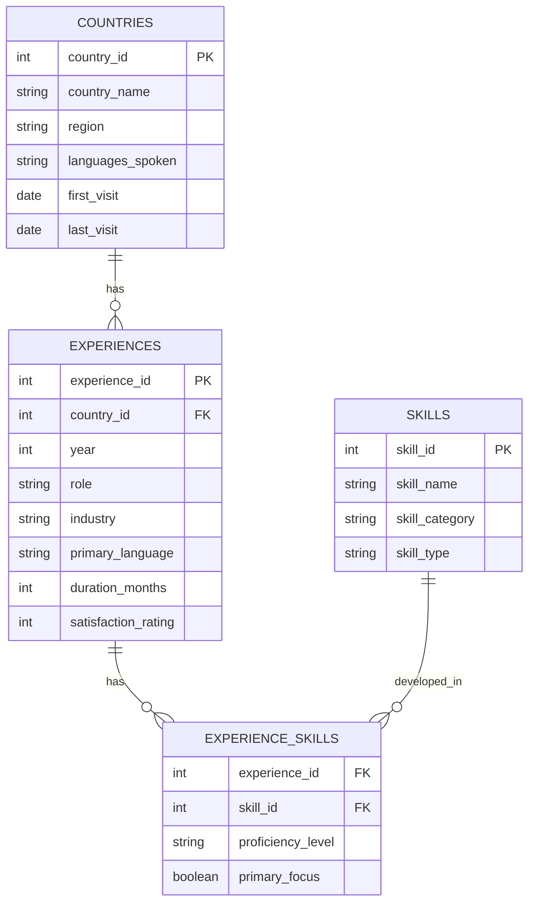

# Entity Relationship Diagram – Life Abroad Analytics

## ER Diagram (Mermaid)

---

## Relationship Details

### countries → experiences (1:Many)
- **Definition**: One country can have multiple experiences (different roles or time periods).
- **Example**: Spain (country_id=4) has experiences: Au Pair (exp_id=4), Receptionist (exp_id=5), Freelancer (exp_id=6), etc.
- **Key**: `country_id` in experiences table references `country_id` in countries table.

### experiences ↔ skills (Many:Many)
- **Definition**: One experience involves multiple skills; one skill can be developed across multiple experiences.
- **Example**: Au Pair in Austria (exp_id=1) developed skills: Adaptability, Cross-cultural Communication, and Childcare. But Adaptability was also developed during UK experience (exp_id=2).
- **Bridge**: `experience_skills` junction table with additional metadata (proficiency, primary focus).

---

## Normalized Design Benefits

1. **No Redundancy**: Skills are stored once, referenced many times.
2. **Flexibility**: Easy to add new countries, experiences, or skills without schema changes.
3. **Query Power**: Joins allow analysis like "Which skills were developed in Spain?" or "How did proficiency in adaptability grow over time?"
4. **Data Integrity**: Foreign keys ensure consistency.

---

## Sample Queries This Enables

- "List all skills developed in Austria."
- "Which country contributed the most new skills?"
- "How did skill proficiency evolve for adaptability across experiences?"
- "Show all experiences where a particular skill was a primary focus."
- "Which industry developed the most technical skills?"
